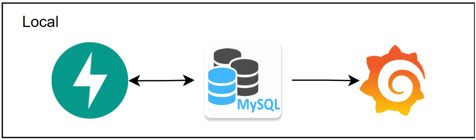
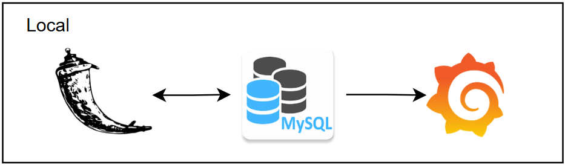

# **microsservice-analysis-score-clustering**
Projeto voltado para a criação de um sistema que irá interagir com um banco de dados acerca de fluxo de caixa e clientela para realizar um perfilamento e acompanhamento histórico dos serviços.

### **Utilizando FastAPI**

### **Utilizando Flask**

## **Fluxo dos dados**
Esse projeto tem como foco realizar um projeto de **análise e ciência de dados** com foco em realizar uma análise histórica dos clientes PJ de uma operação e realizar a implementação de **análises estatísticas** e **aplicação de modelos matemáticos** para realizar um perfilamento e agrupamento dos clientes com base no fluxo de caixa recebido. Segue a abaixo o fluxo pensado:

* Coleta de dados de cliente e fluxo de caixa de um banco de dados;
    Tratamentos e cruzamentos com dados externos (Enriquecimento com dados da Receita Federal, geolocalização e coordenadas);
        Criação de um Score para cada cliente se baseando em uma modelagem baseada em média móvel para definir a nova tendência de clientes e previsão por cliente;
            A partir do Score realizar um agrupamento dos perfilamentos utilizando K-means
                Disponibilização dentro do Grafana!

## **Ferramentas utilizadas - Geral:**
O projeto foi realizado utilizando frameworks baseados em Python (FastApi & Flask) para o processamento dos dados, com uma estrutura de dados para armazenamento dos dados (Nesta branch estou utilizando um servidor MySQL) e a ferramenta Grafana para disponibilização!

# **Ferramentas utilizadas - Detalhamento:**
Processamento:
* Flask (Python 3.13.2);

Armazenamento:
* MySQL Server (8.4);

Disponibilização:
* Grafana;

Sustentação:
* Docker;